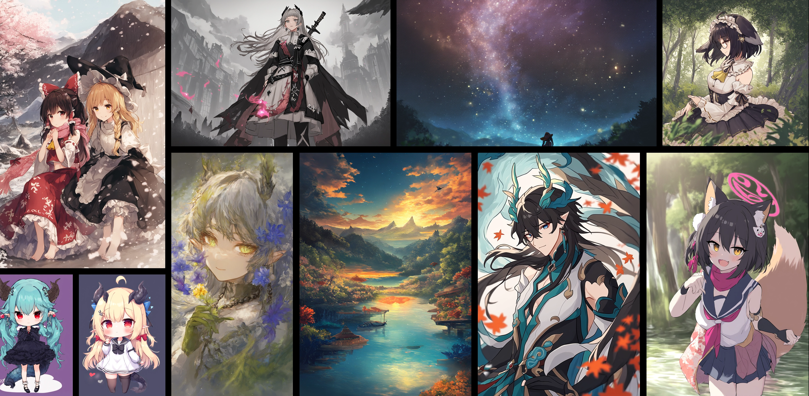

# HDM - Home made Diffusion Models
HDM is a series of models that trained diffusion models (flow matching) from scratch with consumer level hardware in a reasonable cost.
HDM project targeting providing a small but usable base model that can be used for various tasks or perform as a experiment platform or even in practical applications.




## Usage

### ComfyUI
* Install this node: https://github.com/KohakuBlueleaf/HDM-ext
* Ensure the transformers library is >= 4.52
    * if you install it from some manager, it should be handled automatically.

### Installation
For local gradio UI or diffusers pipeline inference, you will need to install this repository into your python environment

* requirements: python>=3.10, correct nvidia driver/cuda installed for triton to work.
* Clone this repo
* Install this repo with following option
    * fused: install xformers/liger-kernel for fused operation
    * win: install triton-windows for torch.compile to work
    * tipo: install tipo-kgen and llama.cpp for TIPO prompt gen
* download model file [`hdm-xut-340M-1204px-note.safetensors`](https://huggingface.co/KBlueLeaf/HDM-xut-340M-anime/blob/main/hdm-xut-340M-1024px-note.safetensors) to `./models` folder
* start the gradio app or check the diffusers pipeline inference script
```bash
git clone https://github.com/KohakuBlueleaf/HDM
cd HDM
python -m venv venv
source venv/bin/activate
# or venv\scripts\activate.ps1 for powershell

# You may want to install pytorch by yourself
# pip install -U torch torchvision xformers --index-url https://download.pytorch.org/whl/cu128
# use [..., win] if you are using windows, e.g. [fused,tipo,win]
pip install -e .[fused,tipo]
```
You can use `uv venv` and `uv pip install` as well which will be way more efficient.

### Gradio UI
Once you installed this library with correct dependencies and download the model to `./models` folder.

Run following commands:
```
python ./scripts/inference_fm.py
```

### Diffusers pipeline
hdm library provide a custom pipeline to utilize diffusers' pipeline model format:
```python
import torch
from hdm.pipeline import HDMXUTPipeline

pipeline = (
    HDMXUTPipeline.from_pretrained(
        "KBlueLeaf/HDM-xut-340M-anime", trust_remote_code=True
    )
    .to("cuda:0")
    .to(torch.float16)
)
images = pipeline(
    "1girl, masterpiece, newest", "worst quality, old"
).images
```

### Training/Finetuning
```
python ./scripts/train.py <train toml config path>
```

## Next Plan
* UNet-based Hires-Fix/Refiner model
    * new arch specially designed for adaptive resolution text-guided latent refiner
* Use more general dataset (around 40M scale)
    * Currently consider laion-coco-13m + gbc-10m + coyohd-11m + danbooru (total 40M)
    * Will finetune from HDM-xut-340M 256px or 512px ckpt for testing this dataset
* Pretrain a slightly larger model (see tech report, the XUT-large, 555M scale model)

## License
This project is still under developement, therefore all the models, source code, text, documents or any media in this project are licensed under `CC-BY-NC-SA 4.0` until the finish of development.

For any usage that may require any kind of standalone, specialized license. Please directly contact kohaku@kblueleaf.net