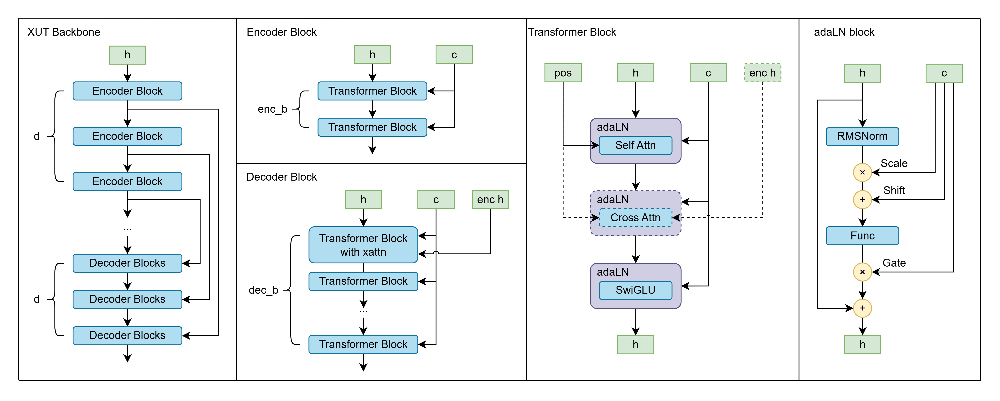

# HDM: Improved UViT-like Architecture with a special recipe for fast pre-training on consumer-level hardware.

## Introduction
* T2I is a very important task in the field of generative models, and it is also a very challenging task.
* Current approaches trying to make model larger and larger, but we want to make it smaller and faster.
* We argue that although large models can achieve better performance, small models can still achieve reasonable performance with proper training strategies.
* We propose a new training strategy for T2I models, whose architecture is based on UViT/HDiT with some intuition on the idea of U-shaped skip connections.

## Preliminary
### Diffusion Models
* 

### UViT/HDiT
* Standard DiT are not sufficient for image generation tasks
* We follow the idea of UNet to construct a U-shaped architecture, but with a transformer backbone.
* UViT/HDiT are two variants of U-shaped transformer architecture, with different designs philosophy.
    * UViT doesn't introduce any downsample/upsample, just use U-shaped connection to make model learn different level features.
    * HDiT introduces downsample/upsample, and use local attention (NATTEN) in higher resolution layers, and global attention in lower resolution layers.

### Efficient Pretraining
* SANA: use DC-AE to obtain very small seq-len, use linear attention to avoid O(N^2) operation, trade off with final quality
* REPA/REPA-E: accelerate convergence, but not fully designed for extrem small training budget
* TREAD: accelerate convergence and step speed, but not fully designed for extrem small training budget

## HDM Methodology

### XUT
Inspired by: UViT/HDiT
* Consider an abstract U-shaped arch: enc -> x -> middle -> y -> merge[x, y] -> dec
    * the "merge" here usually be concat or add or weighted add
    * In XUT, we use Cross Attention to perform the "feature merge"
    * Therefore we call this arch Xross-U-Transformer (XUT)
* In UViT or standard UNet, we usually have lot of skip connections, follow the idea of HDiT, in previous mentioned abstract U-shaped arch, we put a series transformer block in the enc and dec part, which is controled by "enc_blocks" and "dec_blocks", we will repeat this abstract art n-depth times, and result in (enc_blocks + dec_blocks) * n_depth transformer blocks in total. and n_depth cross attention blocks in total. (Cross attention will be placed in the first dec transformer block in each depth)

For example, if we set enc_blocks=1, dec_blocks=2, depth=3, we will have:

inp -trns> a -trns> b -trns> c -trns(c, c)> d -trns(d, b)> e -trns(e, a)> out

where a, b, c, d, e are hidden states of the transformer blocks, and trns is a transformer block with cross attention (if needed)

Why we use Cross Attention?
* We know the U-shaped skip connections are meant to help the model to learn different level features by sending early features to later layers.
* In transformer-based arch, the most intuition way to "sending features" is actually cross attention. So we find no reason to not use it.

### Text Encoder
* In text2image task, the text encoder is a very important part of the model.
* In early days, SD-series model mainly use CLIP text encoder, and add T5-xxl in SD3/SD3.5
* At first ppl use T5-series and CLIP-series model only, but then ppl findout some causal lm like LLaMA, Gemma, Qwen, etc. can also be used as text encoder.
    * Some paper also show that you can fintune LLM to perform as text embedding model. Qwen also released a series of embedding model based on their Qwen models.
    * But in HDM, we didn't apply any trick, we keep the causal lm (unidirectional attention) and directly use the latest hidden state of the text encoder as the text embedding.
    * As the unidirecitonal attention
* In HDM strategy, we use Qwen3-0.6B as the text encoder, as the one of smallest causal lm that can be used as text encoder.

### Minimal Architecture
* In modern T2I models, there are lot of arch try to let the model to handle text and image part separately.
    * DiT: use cross attention to insert text features into image features
    * MMDiT: use seperated adaLN(modulation) and MLP with joint attention
* in HDM strategy, we try to make the model as minimal as possible, so we directly concatenate the text features and image features together as the input sequence of whole backbone.
    * This idea actually more close to what UViT want to do where UViT directly put the class token and time-step token into the input sequence.
    * But we still use adaLN instead of put all the info
* Another crucial improvement is that we use "shared adaLN" to perform modulation in each layer.
    * adaLN(modulation) usually be something like: scale * func(x * gate) + shift
    * In standard DM appraoch (include but not limited to SD/SDXL UNet, DiT, MMDiT, etc.), the scale, shift, gate are all different for each layer, and they are all learned mlp to generate the scale, shift, gate from input cond (timestep or other condition)
    * In HDM strategy, we use a shared adaLN, which means the scale, shift, gate are all same for each layer, and there is only one learned mlp to generate the scale, shift, gate from input cond (timestep or other condition)
    * This is same strategy as Chroma, a pruned version of Flux, which make the Chroma to be 33% smaller than Flux, but still achieve similar capacity
        * first paper about this is https://arxiv.org/abs/2503.10618
        * It showed that shared adaLN can achieve similar performance as standard adaLN, but with much less parameters.

### Positional Encoding
* For position map for HxW images, we keep the range on H axis (rH) and range on W axis (rW) to have following property:
    * rH * rW = 1.0
    * rH/rW = H/W
* therefore our model can handle arbitrary aspect ratio images.
* We use 2d axial rope for first half part of dimension
* For text part we directly use NoPE(https://arxiv.org/abs/2404.12224), since we keep the causal lm to use unidirectional attention, the property that later token are attend with more previous token natively provide kind of "implcit position information"

### Shifted Square Crop
In training, how to handle the aspect ratio is a big problem, especially for T2I tasks.
* Standard approach is to using ARB(Aspect Ratio Bucket) to handle the aspect ratio, which is to resize the images with similar aspect ratio to the same size, than ensure each batch has images with similar aspect ratio.
* But this approach is not very efficient (you need to pre-calc each batches and let the `__getitem__` of dataset implementation to handle whole batch)
* We propose a new approach called Shifted Square Crop, which is inspired by the idea of patch diffusion pretraining. https://arxiv.org/abs/2304.12526

Method:
* Consider a training size X, resize training image I to have shorter side equal to X.
* Make Position Map P, which is a map with size as the resized image, and each pixel in P is the position of the corresponding pixel in the original image.
* Now we randomly choose a position to crop the image I, and crop the position map P accordingly.
* We use this pair (I, P) as the training data (and its position map).
* Follow the idea of 2304.12526, we just need to use not cropped P as the position map in inference then we can get the good final results. And natively support arbitrary aspect ratio.

### TREAD
TREAD paper: https://arxiv.org/abs/2501.04765
* To improve the convergence speed and step speed of the model, we try to utilize some strategies like REPA, REPA-E, etc..
* But we find that although these strategies can improve the convergence speed, the needs of extra ViT model to generate reference features is not very efficient, and the extra MLP for fitting the features is also not very efficient. (REPA-E even need to use an extra backward for VAE)
* Therefore we 

### Dataset
In our first version of HDM, we use a small dataset called Danbooru2023, which is a anime-style image-tag dataset with about 7.6M images.
* We use this dataset because it is small enough to be trained on a consumer-level hardware, and it is also a very good dataset for anime-style image generation tasks.
* For danbooru2023, we use pixtral-11M to generate the Natural language caption for each image, and use the caption as the text condition for the model.

### Inference
Our training methodology introduce tons trick that should be handled specially in inference.
Here we provide a setup/workflow in inference of HDM:
* Disable tread selection in inference
* Generate random noise as X1 for target image size
* Generate full size position map
* Doing flow matching sampling

**About position map**:
Since in training we used cropped position map with cropped image to train the model.
We can observed some interesting phenomenon in inference:
* Due to the bias on aspect ratio distribution of Danbooru dataset, If you generate horizontal images, you will find the model may give you "cropped images", which means the generated images looks like cropped from a large vertical/square images
* But, if you apply some position shift (directly add a shift value onto position map) or zoom (directly multiply a factor onto position map), you will see you can somehow "move" the camera a little bit.
* This property is comes from correct training strategy and positional encoding strategy

Here is examples on shift/zoom the position map:
* x shift: positive means move camera to right, negative means move camera to left
* y shift: positive means move camera to down, negative means move camera to up
* zoom: positive means zoom in, negative means zoom out

|x shift 0.25 | no shift | x shift -0.25 |
|-|-|-|
||||
||||

|y shift 0.25 | no shift | y shift -0.25 |
|-|-|-|
||||

|zoom 0.75 | no zoom | zoom 1.33 |
|-|-|-|
||||

## Training

### Model Scale
To obtain efficient pretraining and inference with consumer level hardwares. We try to make the model as small as possible. We propose 2 different scale of HDM backbone as following

|hyperparam| XUT-base | XUT-large |
|-| - | - |-|
|dim|1024|1280|
|ctx dim(TE model)|1024 (Qwen3-0.6B)|1152 (Gemma3-1B)|
|mlp dim|3072|4096|
|attn heads|8|10|
|attn head dim|128|128|
|xut depth (d)|4|4|
|enc blocks (enc b)|1|1|
|dec blocks (dec b)|3|3|
|N (depth before TREAD selection)| 1|1|
|M (depth after TREAD merge)|3|3|
|Total transformer blocks|20|20|
|Total attention layers|24|24|
|Sequence length at 256x256|256|256|
|Parameters (XUT part)|343M|555M|

In this tech-report we will focus on XUT-base at first to validate the whole recipe and design.

### Recipe
In our training of XUT-base model, we start at 256x256 for early stage than increase the resolution progressively.

We use four RTX5090 to pretrain our model with DDP.

| Stage | 256^2 | 512^2 | 768^2 | 1024^2 |
|-|-|-|-|-|
| Dataset | Danbooru 2023 | Danbooru2023 + extra set* | - | curated set** |
| Image Count | 7.624M | 8.469M | - | 3.649M |
| Epoch | 20 | 5 | 1 | 1 |
| Sample Seen | 152.5M | 42.34M | 8.469M | 3.649M |
| Patch Seen | 39B |43.5B|19.5B| 15B|
| learning rate (muP, base dim = 1) | 0.5 | 0.1 | 0.05| 0.02|
| batch size (per gpu) | 128 | 64 | 64 | 16 |
| gradient checkpointing | no | yes | yes | yes |
| gradient accumulation batch | 4 | 2 | 2 | 4 |
| global batch size | 2048 | 512 | 512 | 256 |
| TREAD selection rate | 0.5 | 0.5 | 0.5 | 0.0 (no TREAD) |
| ctx length | 256 | 256 | 256 | 512 |
| Training Wall Time | 174 hour | 120 hour | 42 hour | 49 hour |

*: extra set include some internal dataset such as photo of pvc figure, or filtered pixiv famous artist set.

**: curated set using Danbooru 2023 and only choose image who fulfill all of following filter
    * Is "masterpiece", "best quality", "low quality", "worst quality"
    * Is "newest", "recent", "old"
    * we use those filter to emphasize the effect of negative prompt

we disable TREAD in latest stage as suggested by the author of TREAD, which be claimed to be better for CFG generation.

### Pre-training cost
Based on pricing information from vast.ai, renting four RTX5090 rig for 385hour require around 535 ~ 620 USD, also all of our pretraining are performed on self-hosted GPU server built with customer level (or second handed server hardware) only, provide an example, which means we push the lower bound of cost of pretraining 1024x1024 T2I model to a new level. (versus previous record around 1000~1500USD using datacenter GPUs)

**NOTE**: All of our training are performed without latent cache or text embedding cache, as cache all the latent/text embedding will require larger disk space than image/caption which may beyond "customer level" range. But with less constrained hardware setup, achiving even lower compute cost is possible.

(for example, caching all text embedding and f8c16 latent of our danbooru dataset require more than 12TB space with f16/bf16 precision. while the dataset only occupy 1.4~1.8TB on disk)

## Results
TBD

## Conclusion
TBD

## References

# Appendix

## Future Plans
* Use more general dataset, currently considering gbc-10m + coyo11m + laion-coco-13m + danbooru (total 40M)
* Try to scale the size of model to ~500M params, with ~1B size text encoder

## Acknowledgements
* Felix Krause: Author of TREAD
* Stefan Andreas Baumann: Author of TREAD, provide lot of insights and help in the process of developing this strategy.
* AngelBottomless: Author of illustrious series model, provide lot of insights in the whole HDM plan. 
* Mahouko (birch lab): provide lot of insights in the whole HDM plan.
* Uptightmoose: provide lot of insights in the whole HDM plan.